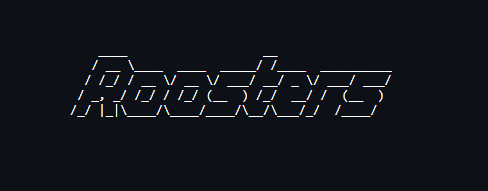
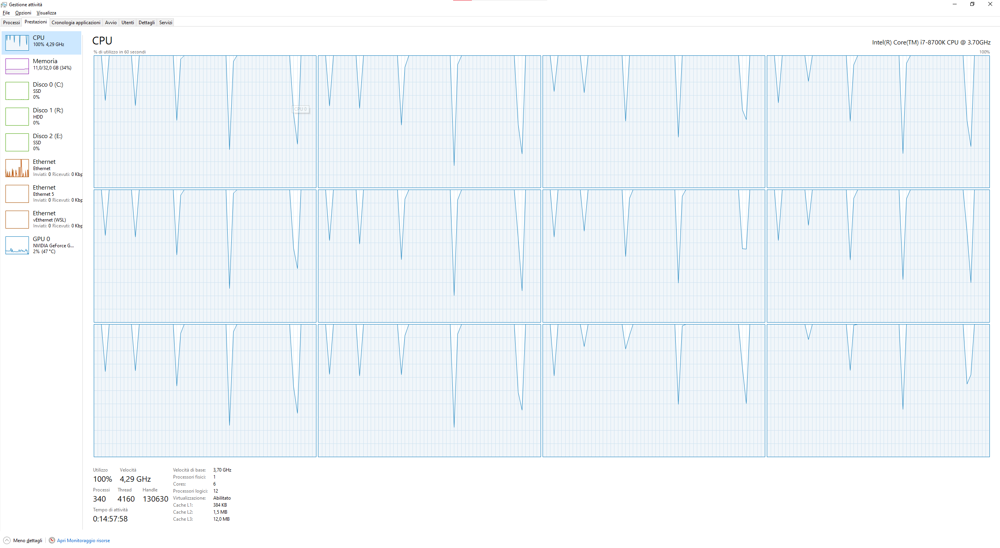

# AML challenge Roosters group

This repo is for the AML challenge for Master in Data Science (2021). 
## Partecipants
- Andrea Lomurno
- Jacopo Mocellin
- Tamara Quaranta
- Filippo Vicari

## Requirements
All the requirements are in the requirements.txt file, which can be easily installed with `pip install -r requirements.txt`

## Objective
The main objective of this project is to create an algorithm able to match the images in a query set with the images in a much larger set called gallery.

## Files
### Image manipulation :: img_manipulation.py
Each image is altered in this way for enhancing the detection of the algorithm:
- `pick_color_channel`: single channel black and white image overwrite the other channel with the value from the choosen one
    - **Options**: img (np array), channel (str = one of "r", "g", "b")
    - **Rationale**: Different channels convey the same information but with slight differences, this should help in discriminating slight patterns
- `noise_over_image`: img (np array), Noise over Image
    - **Options**: prob (float) = the chance to overwrite some random pixel with white or black to create salt and pepper noise
    - **Rationale**: The idea is to avoid overfitting introducing random noise
    - **Enhancement**: Using Numba that allows to compile the code, parallelize the operation and exit from the GIL (Global Interpreter Lock) of python and using all the available threads in the process 
- `fakehdr`: Fake HDR
    - **Options**: img (np array), alpha (int), beta (int), preset (str = "dark" | "light") alpha and beta are the value in which normalize the pixel value, it enhance the shadows or the lights. The presets are quick way to define the aspected result
    - **Rationale**: The idea is to avoid overfitting introducing brightness variance and 
- `visual_fakehdr_debug`: to visualize the changes made to the fakehdr with a single image
    - **Options**:  img (np array), alpha (int), beta (int), preset (str = "dark" | "light") as above
    - **Rationale**:  Sometimes you need to see what are the correct value for certain images this is what this fn() is for
- `global_visual_debugger`: to visualize the changes made to all the images with all the manipulation, can save the image too
    - **Options**:  savefig (bool), fname (str) savefig is the switch to enable or disable saving the images fname is the name of the file in which the user wants to save the composition of all the images with all the variations
    - **Rationale**:  Quick and dirty visual debugger to check if everything is where it needs to be

### Parse image :: parse_image.py
The main file to process the images
- `training_path`: (generator) for the training path
- `validation_gallery_path`: (generator) for the validation_gallery path
- `validation_query_path`: (generator) for the validation_query path
- `Dataset`: (class) 
    - **Options**: mygenerator (generator) that populates some list of the instance
    - **Methods**: 
        - `print_dirs`: pprints the list of all directories
        - `get_dirs`: returns the list of all directories
        - `len_dirs` returns the lenght of the list of all directories (used for twdm progress bar)
        - `print_files`: pprints the list of all files
        - `get_files`: returns the list of all files
        - `len_files` returns the lenght of the list of all files (used for twdm progress bar)
        - `parse_image`: creates a generator saving the current image in a numpy array with cv2
- `create_dir_structure`: check if a dir exist if not it create one, same with subdirectories (up to 2 sub directories)
    - **Options**: basedir (str), subdir=None (str), sub_subdir=None (str)
- `create_processed`: create the processed folder with relative subfolder
- `save_all_images`: for each file in the generator checks wheter the folder/file already exist if it not save there 
    - **Options**: myinstance (instance of the class Dataset)
    - **Additional information**: saves the output in the file `parse.log`
    - **WATCH OUT**: somethimes due to parallelization and/or Windows related stuff some files are not processed, anyway this is just to debug
- `visualize_all_images`: for each file in the generator you can perform a single operation to visualize the debugging process 

